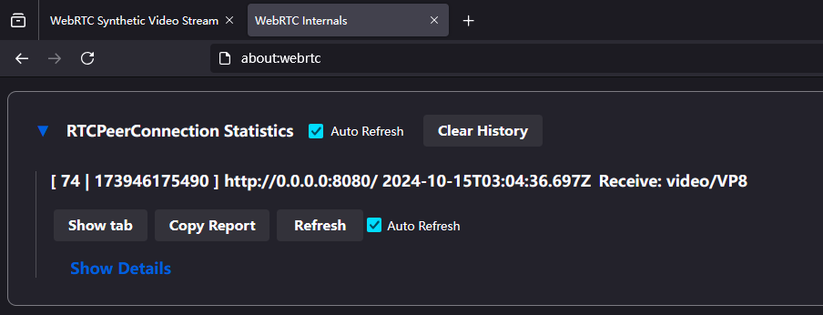

# 笔记

## WebRTC协议栈

WebRTC调用了多个其他协议：ICE, STUN, TURN, DTLS, SRTP, RTP/RTCP, SCTP, UDP, TCP

### 寻找连接路径

- ICE用于寻找最优P2P路径。通讯双方会实时交换自身的所有网卡地址，并不断寻找更优的地址对。
- STUN用于寻找内网设备的公网地址
- TURN用于在直接连接建立失败时提供中继

### 可靠传输

- DTLS用于加密全部WebRTC连接数据
- SCTP用于实现数据流的可靠传输，基于DTLS

### 媒体传输

- SRTP用于加密媒体数据
- RTP/RTCP用于传输数据和获取控制信息，默认基于UDP，UDP被墙等场景会使用TCP

## WebRTC连接建立逻辑

WebRTC首先需要外部协议来协商SDP(Session Description Protocol)，可使用HTTP。
请求方会先生成自身的SDP内容，具体为一段长文本，包括收/发需求，视频/音频信息，编码方式，传输协议栈，网络信息等。
接收方会生成自身的SDP并返回给发送方，双方分别存储本地及目标的SDP至WebRTC接口。
此时WebRTC连接建立完成，协议的实现会在内部管理后续数据交互（例如服务器将请求的track发送给客户端）

## ICE实时更新

ICE(Iteractive Connection Establishment)需要实时更新网络信息，包括ip，连通性，带宽等信息。
ICE信息交换也不在WebRTC内部实现，通常使用WebSocket实现。在C/S架构中，主要由C端发送ICE信息，S端将其更新至WebRTC接口。

## Track的recv方法调用

在连接建立后，WebRTC会不断调用Track的recv方法。对于实际的视频源，recv会在拉取下一帧时产生阻塞。但对于模拟产生的数据，则需要手动延时来控制帧率。

## 视频编码

在未指定视频编码的情况下，WebRTC通过SDP协商选择编码方式。常见的编码方式有VP8, VP9, H264等。

通过打印客户端收到的SDP结果，可以看到服务器支持的编码方式：

```sdp
v=0
o=- 3937949775 3937949775 IN IP4 0.0.0.0
s=-
t=0 0
a=group:BUNDLE 0
a=msid-semantic:WMS *
m=video 54547 UDP/TLS/RTP/SAVPF 120 124 126 127
c=IN IP4 172.22.112.1
a=sendonly
a=extmap:3 urn:ietf:params:rtp-hdrext:sdes:mid
a=extmap:4 http://www.webrtc.org/experiments/rtp-hdrext/abs-send-time
a=mid:0
a=msid:bf7d2da6-02a3-494a-be01-439da48e9b82 8d186f41-9027-46e8-80ac-0246d631addc
a=rtcp:9 IN IP4 0.0.0.0
a=rtcp-mux
a=ssrc-group:FID 1730852774 1567434411
a=ssrc:1730852774 cname:bc4ef421-3ed1-4cad-924e-ace711be2217
a=ssrc:1567434411 cname:bc4ef421-3ed1-4cad-924e-ace711be2217
a=rtpmap:120 VP8/90000
a=rtcp-fb:120 nack
a=rtcp-fb:120 nack pli
a=rtcp-fb:120 goog-remb
a=rtpmap:124 rtx/90000
a=fmtp:124 apt=120
a=rtpmap:126 H264/90000
a=rtcp-fb:126 nack
a=rtcp-fb:126 nack pli
a=rtcp-fb:126 goog-remb
a=fmtp:126 level-asymmetry-allowed=1;packetization-mode=1;profile-level-id=42e01f
a=rtpmap:127 rtx/90000
a=fmtp:127 apt=126
a=candidate:d61185072755a6135428d54d5bbb62ec 1 udp 2130706431 172.22.112.1 54547 typ host
a=candidate:23e782169c6ea8643f546c14030ed84d 1 udp 2130706431 2001:250:3c0f:1006::8343 54548 typ host
a=candidate:d127f0f37d42973ec1cb8bcd1ffb4ee4 1 udp 2130706431 10.249.43.177 54549 typ host
a=candidate:fbcafd3d4c1094c0a9d40244a18edc97 1 udp 2130706431 172.27.128.1 54550 typ host
a=candidate:1368d4fcc2ac6722ae534eb07034ea5d 1 udp 1694498815 58.60.1.69 12712 typ srflx raddr 10.249.43.177 rport 54549
a=end-of-candidates
a=ice-ufrag:7JCa
a=ice-pwd:QkUbwQltDdpLQfRuxRm2JH
a=fingerprint:sha-256 8B:27:35:3B:99:DB:F9:F2:D8:B5:00:AD:AA:08:38:96:BA:12:0C:54:4C:3D:65:DF:53:9F:AF:B1:51:09:B5:84
a=setup:active
```

其中`a=rtpmap:120 VP8/90000`和`a=rtpmap:126 H264/90000`表示服务器支持VP8和H264编码。
90000为时钟频率，用于实现帧排序、帧率控制、音画同步等功能。

`a=rtpmap:124 rtx/90000`和`a=rtpmap:127 rtx/90000`表示服务器支持RTX重传。

在firefox中，可以通过`about:webrtc`查看当前连接的编码方式。
